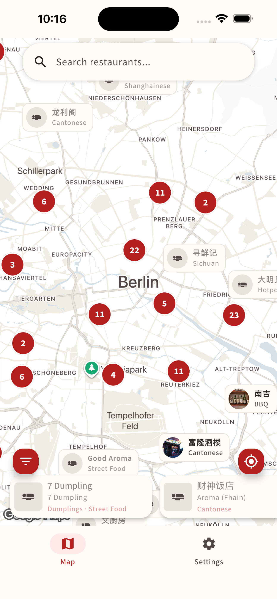
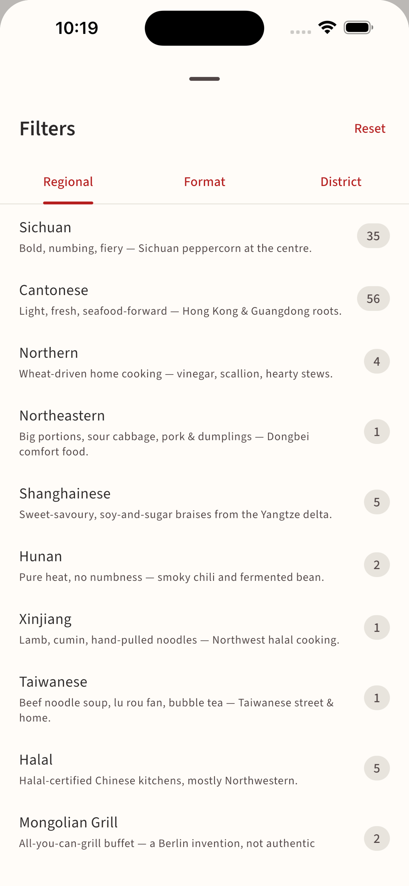
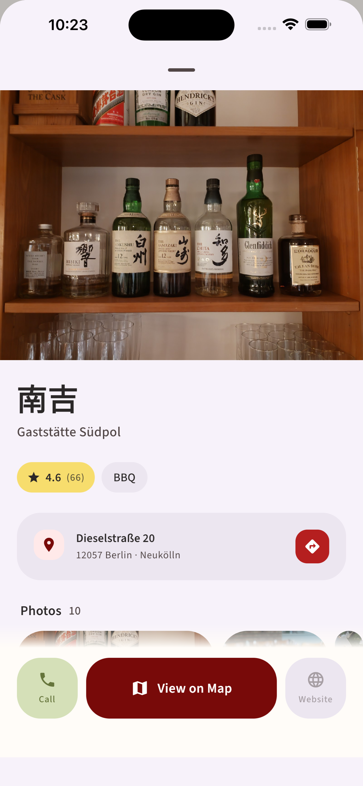
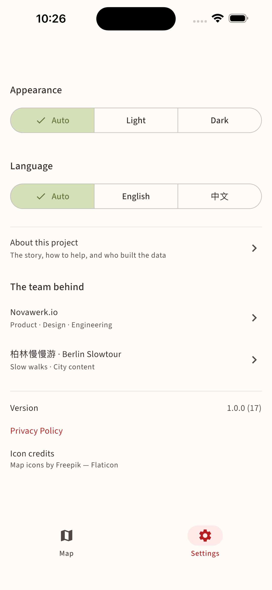

# Berlin Chinese Food Map | 柏林中餐地图

[中文版本](README_ZH.md) | [Project Proposal](PROPOSAL.md) | [Map architecture deep-dive](docs/MAP_PIPELINE.md)

A community-driven, non-profit digital guide to Chinese restaurants in Berlin. Built with Kotlin Multiplatform and Compose Multiplatform for Android and iOS.

**No login required. Privacy-first. Open source.**

**By [Novawerk](https://github.com/Novawerk)** — Open-source apps, made with care.

## Screenshots

<p align="center">
  
  
  
  
</p>

<p align="center"><sub>Map · Filter · Detail · Settings (English UI · iPhone 6.5")</sub></p>

## Project Status

**MVP development in progress.** POC for all four pillars was validated in Q1 2026; the project is now in Phase 2 of the roadmap (polished map UX, restaurant detail screen, data pipeline maturation).

| Component | Status | Notes |
|-----------|--------|-------|
| Mobile App (Android) | Active development | Map, search, detail, settings shipped; favorites + visit-history not yet wired into the UI |
| Mobile App (iOS) | Source-compatible | Builds in Xcode, not built locally per repo policy |
| Data Pipeline | Production | YAML → Firestore CI sync; 22-tag taxonomy validated at CI |
| Landing Page | Live (https://berlinfoodmap.novawerk.io/) | Bilingual, hand-curated copy |
| Admin Panel | Production | Full CRUD for restaurant data |

## Roadmap

| Phase | Focus | Status |
|-------|-------|--------|
| Phase 1 — Kick-off | Data handoff, visual direction, schema alignment | Done |
| Phase 2 — MVP development | Polished map, detail screen, filter UX, opening-hours signals, ASO assets | Active |
| Phase 3 — Beta | Community beta on WeChat / Xiaohongshu, internal feedback loop | Upcoming |
| Phase 4 — Launch | App Store + Play Store submission, UGC mechanism, curated collections | Upcoming |

## Deliverables

- **Native Mobile App** (iOS + Android) — High-performance cross-platform app built with Kotlin Multiplatform
- **Landing Page** (https://berlinfoodmap.novawerk.io/) — SEO-optimized bilingual page for product showcase and app distribution
- **Control Center** — User-friendly admin panel designed for non-technical team members
- **Data Pipeline** — GitHub-based workflow with automated validation and sync for community-contributed content

## Features (current)

### Map screen

- Interactive Google Map (custom Pinwo brand style — desaturated cream base, brand-red pins as the only saturated colour) centred on Berlin with the user's location dot when permission is granted.
- **Marker pills** show the restaurant's cover photo + Chinese name + cuisine/format tag. Cover bitmaps are pre-loaded by the ViewModel so dot ↔ pill collapse cycles don't trigger a re-load. Closed restaurants fade to grey + a moon icon (computed from Google's structured `regularOpeningHours.periods`). Favourited and editor-picked venues get a floating heart / star badge overhanging the pill's top-left corner.
- **Dense-marker collapse (no clustering).** Every restaurant gets its own marker. When a pill would visually overlap another at the current zoom, both collapse to a small circular badge — red dot for normal, red heart for favourite, gold star for editor's pick — so the user always sees individual points-of-interest. Zoom in and the dots expand back into pills. Two-phase: projection on Main, AABB rectangle overlap on `Dispatchers.Default`.
- **Bottom card row** lists restaurants currently in the visible viewport — tap to open the detail sheet without leaving the map.
- **Filter sheet (FAB ↘ filter)** — three quick toggles (Favourites only · Editor's picks only · Open now) plus tabbed pickers for cuisine and format. Picker counts respect the filter from the *other* family. The "Open now" toggle hides venues whose computed status is currently closed; unknown / 24-7 / opening-soon all pass through.
- **Locate-me FAB** — reuses the cached fix when fresh (≤ 60 s) so rapid re-taps animate to the cached coordinates without re-prompting the sensor.

### Restaurant detail (modal sheet)

- Hero cover photo → tap to open a fullscreen pinch-zoom photo pager.
- Title block with bilingual names + chip row (rating · cuisine · price).
- **Hours card** with live open/closed status, today's range, and a countdown ("还有 25 分钟打烊 / 明天 12:00 开门"). Closed venues tint the card `errorContainer`.
- Address card with tinted location + chain-membership chips.
- Optional description (rendered in the user's selected language only).
- **Sticky action bar** pinned to the bottom — Call · 在地图查看 · Website. Maps URL uses the documented `/maps/search/?api=1` form so the user lands on the place card instead of being thrown straight into navigation.

### Search & filter

- Full-text search across Chinese, English, and German names.
- Tag filter (regional family — 川/粤/京等 — and format family — 烤肉/火锅/小吃等), 22 tags total. See `data/_tags.yaml` for the canonical list.
- District filter.

### Cross-cutting

- **Bilingual UI** — English / Chinese (simplified). German is supported as a restaurant-name language only; UI strings are EN/ZH.
- **Dark mode** — system / light / dark, persisted via DataStore.
- **Offline-friendly** — Firestore persistent cache means the map and lists paint immediately on cold launch from the last sync; cover photos are cached by Coil's disk cache.
- **Warm-start map** — `MapViewModel` and `MapControlViewModel` are app-scope DI singletons that get touched at the top of `App()`, so their Firestore observers and the first location fetch run during the splash hold. By the time the splash fades out, the map already has data and tiles in memory.
- **Privacy-first** — anonymous Firebase auth (so the view counter has a stable id), no third-party tracking SDKs, no ads. First-party telemetry (Firebase Analytics + Crashlytics) logs only restaurant ids and short route strings — never restaurant names, search queries, or GPS coordinates. The anon Firebase uid is reused as the Analytics user id and Crashlytics user id so reports group per install.

## Project Structure

This is a multi-platform project with four components:

| Component | Tech | Location |
|-----------|------|----------|
| Mobile App | Kotlin Multiplatform + Compose | `composeApp/` |
| Landing Page | Next.js + Tailwind CSS | `web-apps/landing-page/` |
| Admin Panel | React + Vite + react-admin | `web-apps/admin/` |
| Data Pipeline | YAML + GitHub CI → Firestore | `data/` |

### App Architecture

Single Gradle module (`:composeApp`). Layered:

```
composeApp/src/commonMain/kotlin/com/novawerk/berlinfoodmap/
├── App.kt                          # Root composable, splash → onboarding → main, overlay-based UI
├── di/                             # kotlin-inject AppComponent (@AppScope singletons, KMP)
├── domain/
│   ├── analytics/                  # AnalyticsService interface (events + crash logs)
│   ├── auth/                       # AuthService interface
│   ├── common/                     # Localizable, preferred()
│   ├── favorites/                  # FavoritesRepository
│   ├── restaurant/                 # Restaurant, Tag, GooglePlaceData, OpeningStatus
│   └── settings/                   # SettingsRepository (DataStore-backed)
├── data/
│   ├── remote/                     # FirebaseAuthService, FirestoreRestaurantRepository, FirebaseAnalyticsService
│   └── store/                      # RestaurantStore — app-scoped data layer for the map
└── ui/
    ├── theme/                      # AppTheme, Pinwo brand palette, Source Sans 3 typography
    ├── locale/                     # LocalAppLocale (expect/actual)
    ├── components/                 # Shared composables (TagChips, OpeningStatusBadge, etc.)
    └── pages/
        ├── map/                    # MapScreen + MapViewModel + MapControlViewModel + marker pipeline
        ├── detail/                 # DetailScreen (modal sheet) + photo pager
        ├── search/                 # SearchScreen
        └── settings/               # SettingsScreen (theme + language)
```

The Map and Settings tabs are rendered as a single `MainShell` with the
Settings panel sliding over the live map; a cross-platform `BackHandler`
returns to the map. There is no `NavHost` and no `@Serializable Routes` —
the previous Compose Navigation graph was retired in favour of this
overlay model so the map composable stays mounted across tab switches.

**Map screen specifics** are detailed in [`docs/MAP_PIPELINE.md`](docs/MAP_PIPELINE.md): VM singletons, dense-marker detection, marker bitmap pipeline, the library bug we work around in `StableMarkerIcon`.

### Data Pipeline

Restaurant data is community-contributed via YAML files; everything that the app sees is sourced from `data/restaurants/{district}/{slug}.yaml`. Tags follow a 22-entry canonical taxonomy (10 regional + 12 format) defined in `data/_tags.yaml`. CI validates the taxonomy across the four places it's mirrored, then syncs to Firestore.

See [`data/README.md`](data/README.md) for the full pipeline reference: layout, common operations, scripts cheat-sheet.

## Tech Stack

| Layer | Technology |
|-------|-----------|
| Language | Kotlin 2.2 |
| UI | Compose Multiplatform 1.10 (Material Design 3 Expressive) |
| Navigation | None — `MainShell` renders Map + Settings as overlays with a cross-platform `BackHandler` (`org.jetbrains.compose.ui:ui-backhandler`) |
| State | `androidx.lifecycle.ViewModel` + Compose snapshot state (`mutableStateOf` / `derivedStateOf`); ViewModels are `@AppScope` DI singletons resolved by `AppComponent` so the map warms up during splash |
| Backend | Firebase (Anonymous Auth + Firestore + Analytics + Crashlytics via [`gitlive-firebase`](https://github.com/GitLiveApp/firebase-kotlin-sdk)) |
| Local Storage | Jetpack DataStore (settings + favorites) |
| Maps | [`eu.buney.maps:kmp-maps-compose`](https://github.com/buney-eu/maps) (Google Maps SDK on Android, MapKit on iOS) |
| Image loading | [Coil 3](https://coil-kt.github.io/coil/) (`io.coil-kt.coil3`) with Ktor network fetcher |
| Geolocation | [Compass](https://compass.jordond.dev/) (`dev.jordond.compass`) — handles permissions internally, KMP-friendly |
| DI | [kotlin-inject](https://github.com/evant/kotlin-inject) with KSP, `@KmpComponentCreate`, custom `@AppScope` for process-singleton lifetime |
| Networking | Ktor Client (OkHttp on Android, Darwin on iOS) |
| Date/Time | kotlinx-datetime + `kotlinx-datetime-names` for localised weekday/month strings |
| Targets | Android (SDK 24+, target SDK 36) / iOS (Swift wrapper, framework `ComposeApp`) |
| Build | Gradle with version catalog (`gradle/libs.versions.toml`) |

## Quick Start

```bash
# Prerequisites: JDK 17+, Android SDK

# Build Android
./gradlew :composeApp:assembleDebug

# Install on device/emulator
./gradlew :composeApp:installDebug
```

For iOS, open `iosApp/` in Xcode and build normally. Note: iOS builds require `NSLocationWhenInUseUsageDescription` in `Info.plist` for the Compass geolocator.

For the landing page:

```bash
cd web-apps/landing-page && npm install && npm run dev
```

For the admin panel:

```bash
cd web-apps/admin && npm install && npm run dev
```

## Contributing

We welcome contributions! Whether it's adding a restaurant, fixing a bug, or improving the UI — every bit helps.

1. Fork the repo
2. Create your feature branch (`git checkout -b feature/amazing-restaurant`)
3. Commit your changes (we use [conventional commits](https://www.conventionalcommits.org/))
4. Push to the branch
5. Open a Pull Request

For iOS development, copy `iosApp/Configuration/Config.xcconfig.template` to `Config.xcconfig` and fill in your Team ID.

For data contributions (adding/editing restaurants, adding tags), see [`data/README.md`](data/README.md).

## License

This project is licensed under the [MIT License](LICENSE).

Copyright (c) 2025-2026 [Novawerk](https://github.com/Novawerk) and contributors. You're free to use, modify, and distribute this software, as long as the original copyright notice is included.
