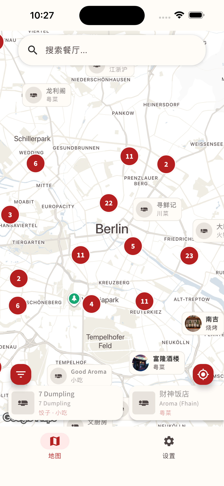
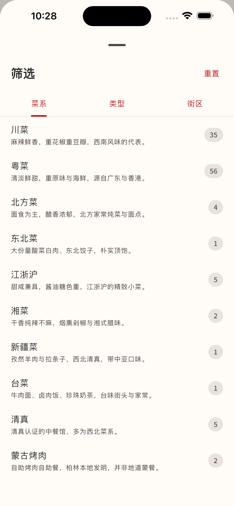
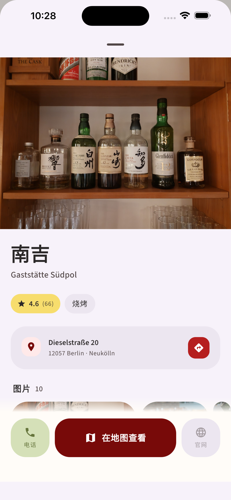
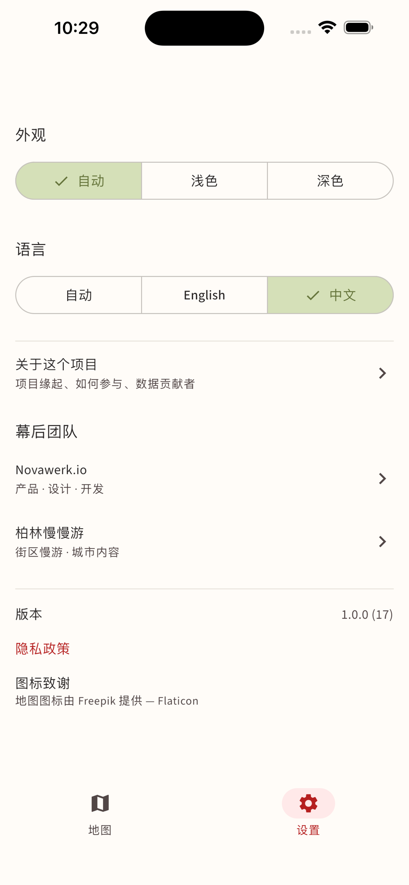

# 柏林中餐地图 | Berlin Chinese Food Map

[English Version](README.md) | [项目协作提案](PROPOSAL.md) | [地图架构详解](docs/MAP_PIPELINE.md)

一款社区驱动的非营利性质柏林中餐馆数字指南。基于 Kotlin Multiplatform 和 Compose Multiplatform 构建，支持 Android 和 iOS。

**无需登录。隐私优先。完全开源。**

**由 [Novawerk](https://github.com/Novawerk) 打造** — 开源应用，用心制作。

## 应用截图

<p align="center">
  
  
  
  
</p>

<p align="center"><sub>地图 · 筛选 · 详情 · 设置（中文界面 · iPhone 6.5"）</sub></p>

## 项目状态

**MVP 开发进行中。** 四大核心模块的 POC 已于 2026 Q1 全部验证完毕；项目目前处于路线图第二阶段（精致地图 UX、餐厅详情页、数据流水线持续打磨）。

| 组件 | 状态 | 说明 |
|------|------|------|
| 移动端 (Android) | 开发中 | 地图、搜索、详情、设置已落地；收藏与足迹功能尚未接入 UI |
| 移动端 (iOS) | 源码兼容 | Xcode 可构建，按仓库约定本地不构建 |
| 数据流水线 | 已上线 | YAML → Firestore CI 同步；22 标签分类法在 CI 时校验 |
| 落地页 | 已上线（https://berlinfoodmap.novawerk.io/） | 双语，手工撰写文案 |
| 管理后台 | 已上线 | 完整餐厅数据 CRUD |

## 实施路线图

| 阶段 | 重点 | 状态 |
|------|------|------|
| 第一阶段 — Kick-off | 数据交接、视觉方向、Schema 对齐 | 已完成 |
| 第二阶段 — MVP 开发 | 精致地图、详情页、筛选 UX、营业时间信号、ASO 素材 | 进行中 |
| 第三阶段 — Beta | 微信 / 小红书社区内测、内部反馈循环 | 即将开始 |
| 第四阶段 — 发布 | App Store + Play Store 上架、UGC 机制、精品策划 | 即将开始 |

## 核心交付产物

- **移动端原生应用** (iOS + Android) — 基于 Kotlin Multiplatform 开发的高性能跨平台原生应用
- **落地页** (https://berlinfoodmap.novawerk.io/) — 经过 SEO 优化的双语落地页，用于产品展示及应用分发
- **控制中心** — 为非技术背景团队成员设计的用户友好型管理后台
- **数据流水线** — 基于 GitHub 的工作流，支持社区贡献内容的自动校验与同步

## 功能特色（当前已实现）

### 地图页

- 自定义 Pinwo 品牌样式的 Google Map（去饱和米色底，仅 POI 用品牌红），默认聚焦柏林并自动显示当前位置（已授权时）。
- **Marker 卡片**展示餐厅封面图 + 中文名 + 菜系/形态 tag。封面位图由 ViewModel 预加载，dot ↔ pill 折叠/展开切换不会触发重新加载。歇业餐厅自动灰化并显示月亮图标（基于 Google `regularOpeningHours.periods` 结构化营业时间计算）。收藏与编辑精选餐厅在卡片左上角悬浮一个红心 / 金星徽章。
- **密集 marker 折叠（不再聚合）。** 每家餐厅都拥有独立 marker；当一个胶囊会与邻居视觉重叠时，两边都收缩成一个圆形小图——普通=红点，收藏=红心，编辑精选=金星——用户始终看到的是单个 POI。放大后小图重新展开成胶囊。两阶段执行：projection 在 Main，AABB 矩形重叠在 `Dispatchers.Default`。
- **底部卡片行**列出当前视野内的餐厅 — 点击直接打开详情 sheet，地图状态保留。
- **筛选 sheet（左下 FAB）** — 三个快捷开关（仅看收藏 · 仅看编辑精选 · 仅看营业中）+ 菜系 / 风味两个分 Tab 选择器。"仅看营业中"会隐藏当前已打烊的餐厅，营业时间未知 / 24 小时 / 即将开门均通过。菜系与风味分类时，各行计数会考虑另一家族的当前选择。
- **当前位置 FAB** — 缓存的位置 ≤ 60 秒内重复点击直接平移到缓存坐标，不再触发权限/传感器请求。

### 餐厅详情（模态 sheet）

- 封面大图，点击打开支持双指缩放的全屏图片浏览器。
- 标题区：双语名称 + chip 行（评分 · 菜系 · 价格）。
- **营业时间卡片** — 带实时开/关状态、今日营业时段、倒计时（"还有 25 分钟打烊 / 明天 12:00 开门"）。歇业时整张卡变 `errorContainer` 红色调。
- 地址卡片，配套色 icon 和连锁标识 chip。
- 可选描述（按用户当前语言渲染，不再双语堆叠）。
- **底部固定操作栏** — 拨打电话 · 在地图查看 · 网站。在地图查看用 `/maps/search/?api=1` 形式打开 Google Maps 商家页（而不是直接进导航），让用户先确认再操作。

### 搜索与筛选

- 中文、英文、德文名全文搜索。
- Tag 筛选（regional 家族 — 川/粤/京等 — 和 format 家族 — 烤肉/火锅/小吃等），共 22 个 tag。详见 `data/_tags.yaml`。
- 街区筛选。

### 横向能力

- **双语 UI** — 英文 / 简体中文。德文仅作餐厅名语言；UI 字符串只有 EN/ZH。
- **深色模式** — 跟随系统 / 强制浅色 / 强制深色，由 DataStore 持久化。
- **离线友好** — Firestore 持久化缓存让冷启动时地图和列表立刻渲染上次同步内容；封面图由 Coil disk cache 缓存。
- **暖启动地图** — `MapViewModel` 与 `MapControlViewModel` 都是 `@AppScope` 的 DI 进程级单例，在 `App()` 顶端被触达，所以它们的 Firestore 观察者和首次定位获取都在 splash hold 期间并行进行。splash 淡出时地图已经有数据和瓦片在内存中。
- **隐私优先** — 匿名 Firebase auth（仅用于 view-counter 稳定 id），无第三方追踪 SDK，无广告。一方遥测（Firebase Analytics + Crashlytics）只记录餐厅 id 和短路由字符串 — 不记录餐厅名、用户输入的搜索词、GPS 坐标。匿名 Firebase uid 同时作为 Analytics user id 和 Crashlytics user id，便于按安装聚合。

## 项目结构

多平台项目共四个组件：

| 组件 | 技术栈 | 位置 |
|------|--------|------|
| 移动端应用 | Kotlin Multiplatform + Compose | `composeApp/` |
| 落地页 | Next.js + Tailwind CSS | `web-apps/landing-page/` |
| 管理后台 | React + Vite + react-admin | `web-apps/admin/` |
| 数据流水线 | YAML + GitHub CI → Firestore | `data/` |

### 应用架构

单 Gradle module (`:composeApp`)，分层清晰：

```
composeApp/src/commonMain/kotlin/com/novawerk/berlinfoodmap/
├── App.kt                          # 根 composable，splash → onboarding → main，覆盖式 UI
├── di/                             # kotlin-inject AppComponent（@AppScope 单例，KMP）
├── domain/
│   ├── analytics/                  # AnalyticsService 接口（事件 + 崩溃日志）
│   ├── auth/                       # AuthService 接口
│   ├── common/                     # Localizable, preferred()
│   ├── favorites/                  # FavoritesRepository
│   ├── restaurant/                 # Restaurant, Tag, GooglePlaceData, OpeningStatus
│   └── settings/                   # SettingsRepository (DataStore 实现)
├── data/
│   ├── remote/                     # FirebaseAuthService, FirestoreRestaurantRepository, FirebaseAnalyticsService
│   └── store/                      # RestaurantStore — 地图的 app 级数据层
└── ui/
    ├── theme/                      # AppTheme, Pinwo 品牌色板, Source Sans 3 字体
    ├── locale/                     # LocalAppLocale (expect/actual)
    ├── components/                 # 共享组件 (TagChips, OpeningStatusBadge, …)
    └── pages/
        ├── map/                    # MapScreen + MapViewModel + MapControlViewModel + marker 管线
        ├── detail/                 # DetailScreen (模态 sheet) + 全屏图片浏览
        ├── search/                 # SearchScreen
        └── settings/               # SettingsScreen (主题 + 语言)
```

地图与设置两个 Tab 由单一 `MainShell` 渲染，设置面板以浮层形式覆盖在
活的地图之上，跨平台 `BackHandler` 负责返回地图。已没有 `NavHost` 也
没有 `@Serializable Routes` — 之前的 Compose Navigation 路由图被移除，
换成这套覆盖模型，让地图 composable 在 Tab 切换中保持挂载。

**地图页的细节**详见 [`docs/MAP_PIPELINE.md`](docs/MAP_PIPELINE.md)：VM 单例化、密集 marker 折叠算法、marker 位图管线、为什么需要绕开库的 bug 自己写 `StableMarkerIcon`。

### 数据流水线

餐厅数据由社区通过 YAML 文件贡献；App 看到的所有数据都源自 `data/restaurants/{district}/{slug}.yaml`。Tags 遵循 22 项标准化分类（10 个 regional + 12 个 format），定义在 `data/_tags.yaml`。CI 校验四处镜像位置一致后再同步到 Firestore。

完整流程参考详见 [`data/README.md`](data/README.md)：目录结构、常见操作、脚本速查。

## 技术栈

| 层 | 技术 |
|----|------|
| 编程语言 | Kotlin 2.2 |
| UI | Compose Multiplatform 1.10 (Material Design 3 Expressive) |
| 导航 | 无——`MainShell` 用浮层方式渲染地图与设置，由跨平台 `BackHandler`（`org.jetbrains.compose.ui:ui-backhandler`）负责回退 |
| 状态 | `androidx.lifecycle.ViewModel` + Compose snapshot state (`mutableStateOf` / `derivedStateOf`)；ViewModel 是 `@AppScope` 的 DI 进程级单例，由 `AppComponent` 提供，让地图在 splash 阶段就开始预热 |
| 后端 | Firebase（匿名 Auth + Firestore + Analytics + Crashlytics，通过 [`gitlive-firebase`](https://github.com/GitLiveApp/firebase-kotlin-sdk)） |
| 本地存储 | Jetpack DataStore（设置项 + 收藏） |
| 地图 | [`eu.buney.maps:kmp-maps-compose`](https://github.com/buney-eu/maps)（Android 用 Google Maps SDK，iOS 用 MapKit） |
| 图片加载 | [Coil 3](https://coil-kt.github.io/coil/) (`io.coil-kt.coil3`) + Ktor 网络 fetcher |
| 定位 | [Compass](https://compass.jordond.dev/) (`dev.jordond.compass`)——内部处理权限流，KMP 友好 |
| DI | [kotlin-inject](https://github.com/evant/kotlin-inject) + KSP，`@KmpComponentCreate`，自定义 `@AppScope` 实现进程级单例 |
| 网络 | Ktor Client（Android 用 OkHttp，iOS 用 Darwin） |
| 日期时间 | kotlinx-datetime + `kotlinx-datetime-names` 本地化星期/月份 |
| 目标平台 | Android (SDK 24+，target SDK 36) / iOS（Swift wrapper，framework 名 `ComposeApp`） |
| 构建 | Gradle + version catalog (`gradle/libs.versions.toml`) |

## 快速开始

```bash
# 前置依赖：JDK 17+，Android SDK

# 构建 Android 调试包
./gradlew :composeApp:assembleDebug

# 安装到连接的设备/模拟器
./gradlew :composeApp:installDebug
```

iOS 端：在 Xcode 中打开 `iosApp/` 正常构建即可。注意：iOS 构建需在 `Info.plist` 中加入 `NSLocationWhenInUseUsageDescription`（Compass 定位用）。

落地页：

```bash
cd web-apps/landing-page && npm install && npm run dev
```

管理后台：

```bash
cd web-apps/admin && npm install && npm run dev
```

## 参与贡献

欢迎贡献！无论是添加餐厅信息、修复 bug、改进 UI 还是其他——每一份贡献都很重要。

1. Fork 本仓库
2. 创建你的 feature 分支 (`git checkout -b feature/amazing-restaurant`)
3. 提交你的修改（我们使用 [conventional commits](https://www.conventionalcommits.org/) 规范）
4. 推送到分支
5. 提交 Pull Request

iOS 开发：将 `iosApp/Configuration/Config.xcconfig.template` 复制为 `Config.xcconfig` 并填入你的 Team ID。

数据贡献（添加/编辑餐厅、新增 tag）请参见 [`data/README.md`](data/README.md)。

## 开源协议

本项目基于 [MIT 协议](LICENSE) 开源。

版权所有 (c) 2025-2026 [Novawerk](https://github.com/Novawerk)。在保留原始版权声明的前提下，您可以自由使用、修改和分发本软件。
